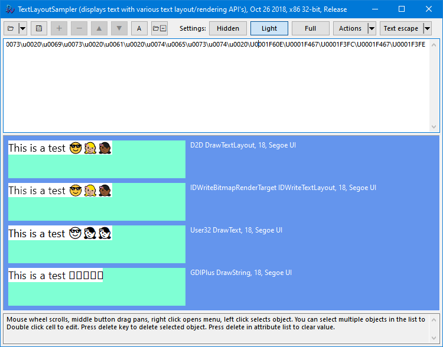

# TextLayoutSampler
Utility to display text via multiple Windows API's simultaneously.

Supports:
- Arbitrary number of text objects with different text, font, direction, language, and rendering settings.
- DirectWrite, Direct2D, GDI, GDI+

C++, compiled with Visual Studio 2017 RC.

