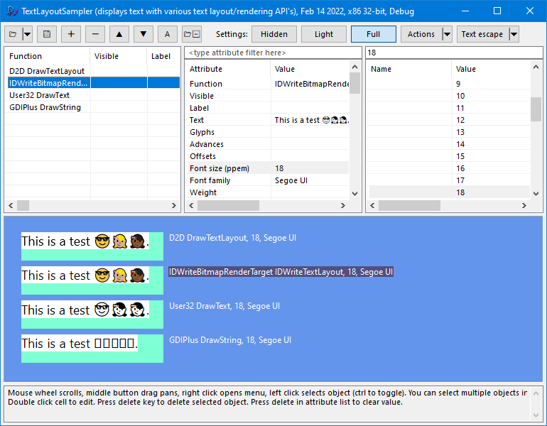

# TextLayoutSampler
Utility to display text via multiple Windows API's simultaneously to compare differences in rendering, font selection, and shaping.

Supports:
- Arbitrary number of text objects with different text, font, direction, language, and rendering settings.
- DirectWrite, Direct2D, GDI, GDI+
- Requires Windows 7+. Certain features like Direct2D SVG rendering requires Windows 10 RS4.

C++, compiled with Visual Studio Professional 2017 Version 15.6.5 (Community Edition should work too).

